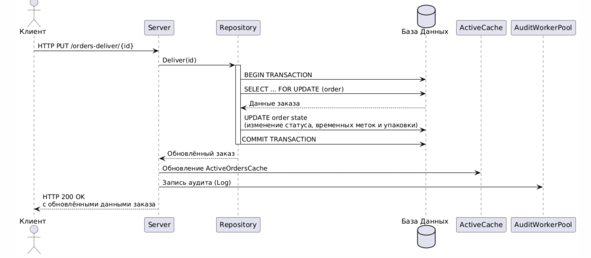
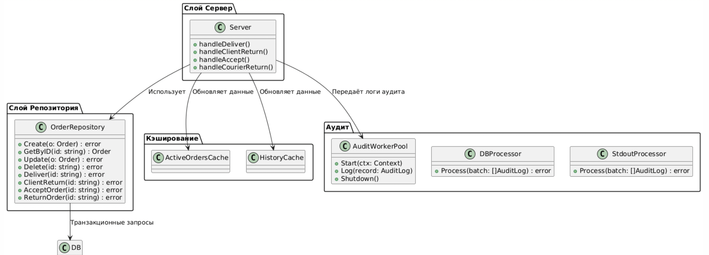

## UML-диаграмма




# Процесс Обновления Состояния Заказа
1. Получение запроса.
Клиент посылает HTTP-запрос для изменения состояния заказа (например, для выдачи заказа клиенту или принятия заказа от курьера).

2. Обработка запроса на сервере.
Сервер определяет нужный обработчик и вызывает соответствующий метод репозитория. Дополнительно осуществляется логирование перехода состояния через систему аудита.

3. Запуск транзакции.
В методе репозитория начинается транзакция. Выполняется выборка заказа с блокировкой (SELECT ... FOR UPDATE) для исключения конкурентного доступа.

4. Изменение данных заказа.
Внутри транзакции обновляются необходимые поля заказа (например, установка временной метки, изменение статуса, обновление данных упаковки).

5. Фиксация транзакции.
Если все операции прошли успешно, транзакция фиксируется (commit). В противном случае происходит откат (rollback), и изменения не применяются.

6. Обновление кэша.
После успешного обновления базы сервер обновляет активный кэш заказов, чтобы в оперативной памяти были актуальные данные для последующих запросов.

7. Логирование.
Система аудита регистрирует изменения состояния заказа, что позволяет отслеживать историю всех операций.


## Запуск тестов
Создайте базу данных 
```bash
make create-db
```
Накатите миграции
```bash
make migrate-up
```
Запустите тесты 
```bash
make test
```

## CURL-запросы

Создаёт новый заказ – аналог “acceptOrder”.
```bash
curl -X POST http://localhost:9000/orders \
-u admin:secret \
-H "Content-Type: application/json" \
-d '{
"id": "order123",
"recipient_id": "user42",
"storage_deadline": "2025-01-01T12:00:00Z",
"weight": 3.5,
"cost": 100.0,
"packaging": ["box", "film"]
}'
```

Возвращает список заказов, сортируя по id, с курсорной пагинацией.
```bash
curl -X GET "http://localhost:9000/orders?cursor=order001&limit=2"
```

Возвращает один заказ по id.
```bash
curl -X GET "http://localhost:9000/orders/order123"
```

Позволяет изменить поля заказа (ID в теле должен совпадать с id в URL).
```bash
curl -X PUT "http://localhost:9000/orders/order123" \
-u admin:secret \
-H "Content-Type: application/json" \
-d '{
"id": "order123",
"recipient_id": "user999",
"storage_deadline": "2025-07-01T12:00:00Z",
"packaging": ["bag"],
"weight": 6.5,
"cost": 250
}'
```

Позволяет изменить поля заказа (ID в теле должен совпадать с id в URL).

```bash
curl -X DELETE "http://localhost:9000/orders/order123" \
  -u admin:secret
```

Переводит заказ в состояние «delivered».
```bash
curl -X PUT "http://localhost:9000/orders-deliver/order123" \
  -u admin:secret
```

Переводит заказ в состояние «client_rtn» (возврат от клиента).

```bash
curl -X PUT "http://localhost:9000/orders-return/order123" \
  -u admin:secret
```

Возвращает заказы, которые в состоянии «client_rtn», с пагинацией через offset/limit.

```bash
curl -X GET "http://localhost:9000/returns?offset=0&limit=10"
```
